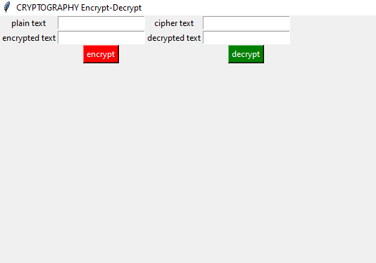

# Cryptography-Encrypt-Decrypt

This python program uses modules to complete cryptography requirement in GUI Interface.

It uses onetimepad and Tkinter modules.

Type "pip install onetimepad" in the command prompt to install onetimepad module in python.

